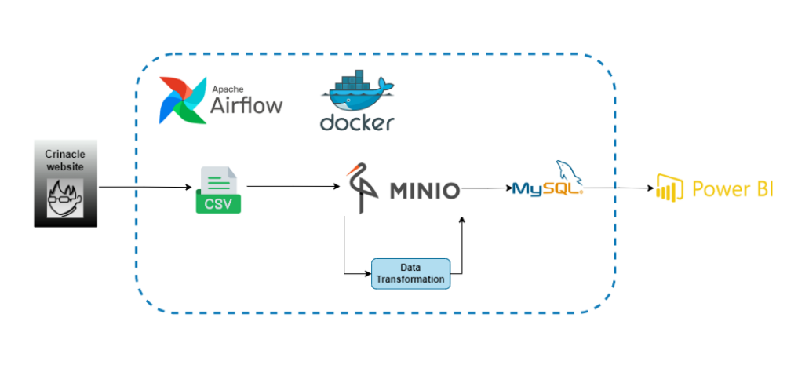
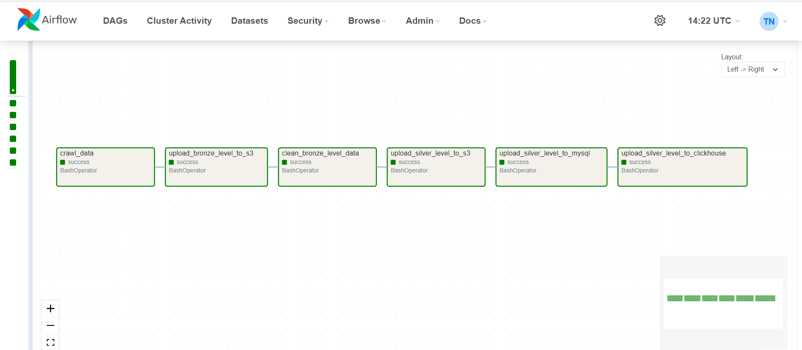
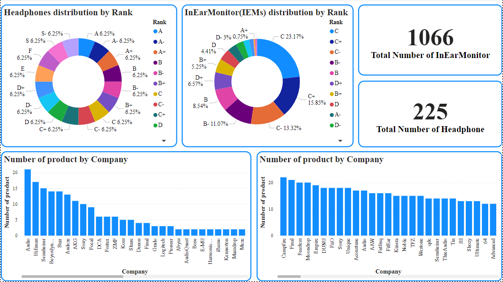

# Audio Device Data Pipeline

## Introduction
This project automates the ETL process using Airflow and Docker. It involves scraping data from crinacle.com and storing it in MinIO. The data is then transformed and re-uploaded to MinIO, followed by loading it into MySQL. Finally, a Power BI dashboard is created to visualize the data from MySQL.

## Technologies Used
1. Programming Language - Python
2. Data Storage - MinIO (S3-compatible)
3. Workflow Management - Apache Airflow
4. Data Visualization - Power BI
5. Container Platform - Docker
7. Database - MySQL

## Architecture

**DAG Tasks:**

## Run The Project
1. **Ensure Docker is installed:**
   - Docker is required to run the project. Make sure you have Docker installed and running on your system.

2. **Prepare environment for MinIO:**
   - Navigate to the `minio` directory.
   - Rename the `.env.example` file to `.env`.
   - Set the appropriate values for environment variables in the `.env` file.

3. **Run MinIO:**
   - In the `minio` directory, run the command: `docker compose up -d`.
   - Once MinIO is up and running, create a new bucket and generate access and secret keys if needed.

4. **Prepare Airflow environment:**
   - At the root directory of your project, rename the `.env.example` file to `.env`.
   - Set the necessary values for environment variables in the `.env` file.

5. **Run Airflow:**
   - At the root directory of your project, run the command: `docker compose up -d`.

6. **Connect Networks:**
   - Connect the `airflow` container to the network of the `minio` container by running the command: `docker network connect <network-name-of-minio> <container-name-of-airflow>`.
   - To list all networks, use the command: `docker network ls`.

7. **Access the UIs:**
   - Open the Airflow UI in your browser at: `http://localhost:8080`.
   - Open the MinIO UI in your browser at: `http://localhost:9001`.

**Note:** Ensure that the ports set up for MySQL are correctly mapped to localhost so that data can be uploaded. This configuration allows you to interact with these databases via the specified ports on your local machine.

## Dashboard

## Documentation
- https://www.astronomer.io/guides/dag-best-practices/  

